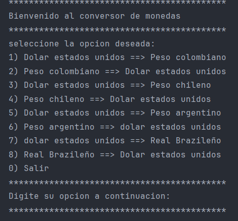
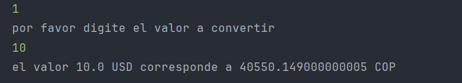

# :money_with_wings: CONVERSOR DE MONEDAS

Conversor de Monedas es una aplicación de consola desarrollada en Java que permite convertir montos entre distintas monedas utilizando tasas de cambio obtenidas desde una API externa. El usuario puede ingresar la moneda inicial, la moneda destino y el monto a convertir, y la aplicación se encargará del resto.

## :hammer: Funcionalidades del proyecto

- `Entrada interactiva`: Solicita al usuario el tipo de moneda de origen, destino y el monto.
- `Consumo de API`: Se conecta a una API externa para obtener la tasa de cambio en tiempo real.
- `Conversión precisa`: Realiza la conversión y muestra el resultado al usuario.
- `Validación`: Verifica entradas y gestiona errores como códigos inválidos o montos no numéricos.

## :ballot_box_with_check: Tecnologías utilizadas

- `Java 17`
- `API REST`: Para obtener tasas de cambio en tiempo real
- `Librerías estándar de Java` (java.util, java.net, java.io)

## :clipboard: Instrucciones de uso

1. Ejecuta la clase `Main`.
2. Ingresa el código de la moneda de origen (por ejemplo, USD).
3. Ingresa el código de la moneda destino (por ejemplo, EUR).
4. Ingresa el monto que deseas convertir.
5. Recibe el resultado con la conversión aplicada.

### :warning: Requisitos previos

- Tener instalada una versión de Java 17 o superior.
- Acceso a internet para conectarse a la API de tasas de cambio.

## :file_folder: Estructura del Proyecto

- `Main.java`: Punto de entrada de la aplicación.
- `PedirTazaDeCambio.java`: Clase que se encarga de obtener la tasa de cambio desde la API.
- `Cambio.java`: Modelo para representar la estructura de la respuesta de la API.
- `Conversion.java`: Lógica para calcular la conversión de moneda.

## :camera: Capturas de pantalla

### 🏁 Inicio del programa

### 💱 Resultado de la conversión
